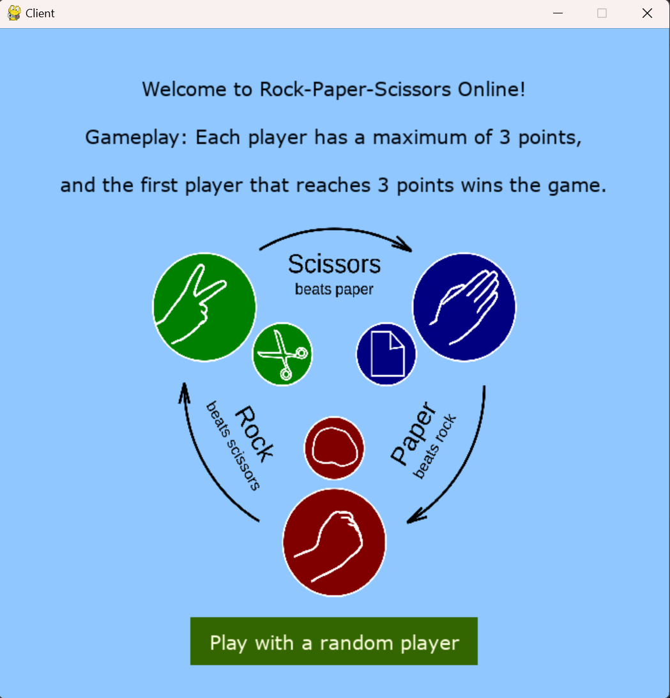
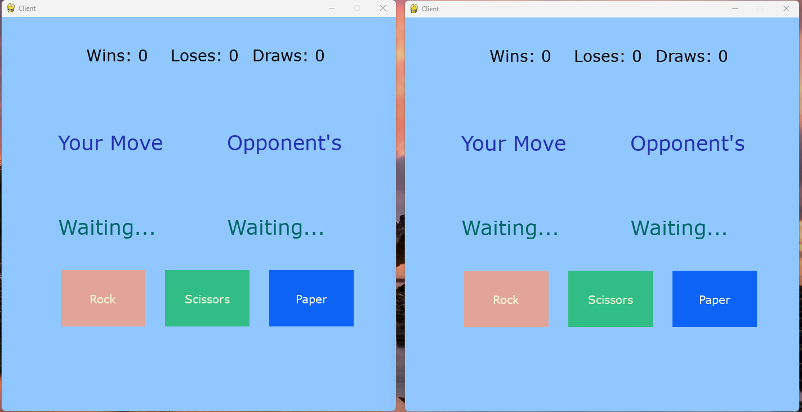
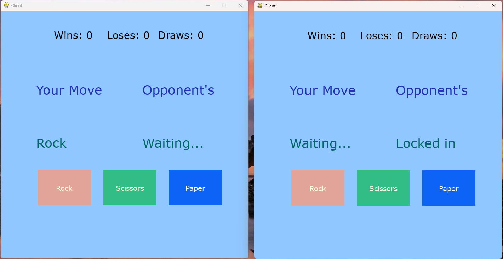
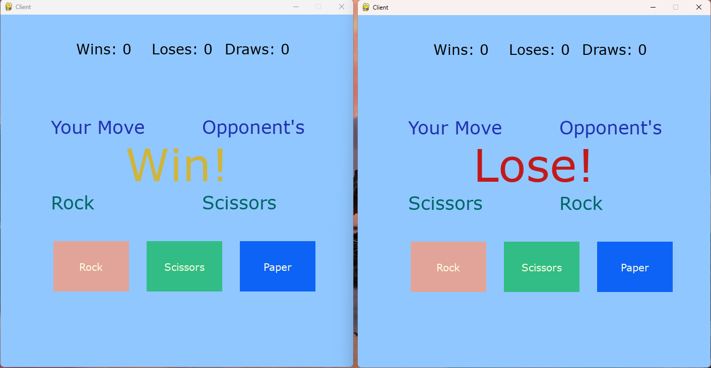
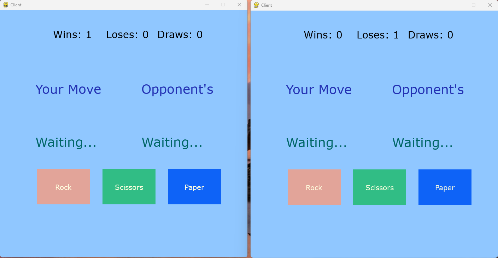
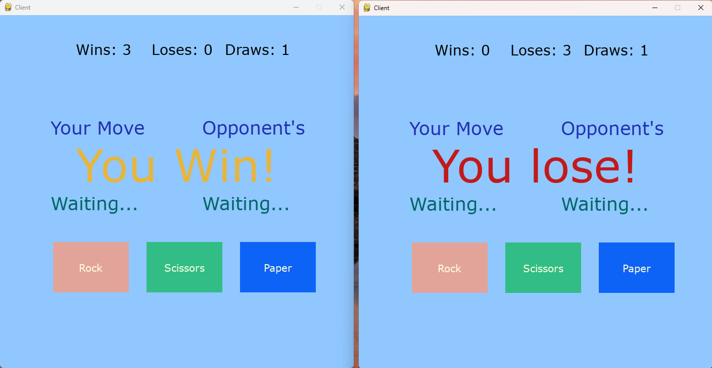
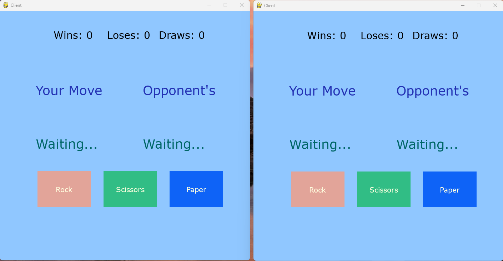

# Industry track

## Student List:

| Group Member  | Student ID | Email                         | Chosen destiny |
| ------------- | ---------- | ----------------------------- | -------------- |
| Hung Trinh    | 2307229    | Hung.TRINH@student.oulu.fi    | Corporate      |
| Mazen Hassaan | 2307227    | Mazen.Hassaan@student.oulu.fi | Corporate      |
| Umer Yaseen   | 2307645    | Umer.Yaseen@student.oulu.fi   | Corporate      |
| Ida Haataja   | Y69019019  | ida.haataja@student.oulu.fi   | Corporate      |

## Project Title

Multiplayer Rock, Paper, Scissors Game

## About the project

### Course Project Overview

The project aims to design and implement a distributed system used for a multiplayer Rock, Paper, Scissors game. The software and system architecture aim to address key distributed system functionalities learned throughout the course. The main goal of this project is to effectively tackle the fundamental functionalities inherent in distributed systems, drawing upon the comprehensive knowledge acquired throughout the duration of the course. The application clients acting as game nodes, a central server managing game state and communication, and the ability of server replication based on the load request and game conditions.

### Project Objectives

- Design and implement a distributed system for a multiplayer Rock, Paper, Scissors game.
- Implement a straightforward method for clients to establish real-time connections with the server in a straightforward manner.
- Develop a simple resource naming mechanism and sharing mechanisms to manage game state and communication.
- Create a basic load balancing mechanism for the server node through replication.
- Modify a somewhat centralized organizational software architecture to facilitate vertical communication between the server and the clients.

### Expected Outcomes

- A simple functional multiplayer Rock, Paper, Scissors game accessible to players from different locations.
- Real-time gameplay experience with immediate feedback on match results.
- Efficient resource utilization and scalability through load balancing mechanisms.
- Demonstrated application of distributed system principles in building responsive and scalable gaming applications.
- Building a robust foundation for a game that is scalable and can be further expanded upon in the future.

## Implemented components:

  The system is structured around a Centralized logical organization, characterized by vertical communication between the server and clients. It supports multiple server and client nodes, enabling scalability. The system can have as many server nodes as it needs and as many client nodes as possible. Due to this nature, a replication mechanism aimed for load balancing was implemented, which will be discussed in detail later.

Each node functions either as a server or a client out of two clients that initiate a game, with two clients required to initiate a game.
Each connected server and client operates as a somewhat independent entity with partial autonomy. However, given the game's requirements for full engagement among all nodes involved in a game, the failure of one node results in the failure of the entire system, or instance of the game.

  In this client-server architecture project, nodes communicate by exchanging messages facilitated by the network, which is implemented as an object of itself within the system.
The client sends a variety of messages such as hard-reset, soft-reset, find-winner, and the chosen move itself, via the network interface to the server. The server then receives and processes these messages based on the data they contain.

Also, a simlpe straightforward logging process is incorporated, where the server monitors newly connected clients and any instances of server replication. The server logs these operations information in a clear and easily comprehensible way.

Relevant principles covered in the course:
- Message transmission between nodes via a clearly defined interface, ensuring strong familiarity with application semantics between clients and the server. Additionally, continuous communication is maintained between nodes through socket interfaces.
- Implementation of replication to enhance availability, particularly when accommodating a large number of players, and to effectively manage load balancing. Despite the simplicity of the program, it serves as an implementation of the replication concept itself.
- The system architecture follows a Centralized Logical Organization with a vertical structure, where clients adhere to a request/reply model. Newly generated servers, stemming from replication, adopt a concurrent multithreaded server approach. Initially, there exists a single entry server to the application, which then spawns server instances based on the number of connecting clients.
- A straightforward structured naming mechanism is also established, assigning each client a unique and non-repetitive name regardless of their connection to the server. This structured naming convention adopts the format: game_id/client_id_within_game. This simplicity in naming aims to support the project's goal of serving as a foundational building stone for future scalability, extensibility, and feature integration.

## Built with:

The project is developed using Python, employing an object-oriented approach where there's a server class, a client class, a game instance class and a  network class serving as the communication interface. The project also utilizes direct socket interface manipulation to communicate between the servers and the clients instances. The used internet communication protocol is TCP along with the needed IP configurations.

- **The server class:** It initializes the server with the provided IP address and port number, along with other necessary attributes such as the socket and game instances. It binds the socket to the provided IP address and port, then listens for incoming connections from clients. It also handles the connection as upon connection from a client, it accepts the connection and assigns a unique identifier to the client. If necessary, it creates a new game instance. Threaded Client Handling is also supported where each connected client is handled in a separate thread to allow multiple clients to interact with the server simultaneously. It also serializes and sends the game state back to the clients using the Pickle module for data serialization
- **The Client Class:** Mainly handles the user interface and the player interaction. It initializes the Pygame window and handles Pygame events such as mouse clicks to enable the interaction with the game interfaces, and it sets up the necessary components for the user interface. The button class included in the client is used to create interactive buttons on the screens of the users. The overall main function of the client class is that it handles the main game loop, including sending and receiving game data from the server, updating the game interface based on player actions, and displaying the game results.
- **The Network Class:** The Network class serves as the communication interface betgween the client and server, enabling the exchang of game-related information in the real-time environment.
- **The Game Class:** The Game class encapsulates the game logic implementation, allowing for the management of player moves, determination of winners, and tracking of game progress. It provides methods to record and retrieve relevant player moves within a game. It also provides methods to reset the game states, whether a soft reset (scope of one round) or a hard reset (scope of the whole game).


## Getting Started:

Instructions on setting up your project locally:
**How to Run the Server**

Open `settings.py` and change the IP to the network IP of the device running the server and change the PORT number to any open port as desired such as `ip = <Your Local Network IP address>` and `port = <CHOSEN PORT NUMBER>`.

```
$ git clone https://github.com/manhhungking/Rock-paper-scissor.git
$ cd Rock-paper-scissor
$ python server.py
```

**How to Run the Client**

Run as many instances for the clients as you want using the terminals. At least 2 clients have to be opened and connected to start a game

```
$ python client.py
```

**Demo**

##### One client connected and ready to play, One client open

<p align="center">
  
</p>

##### Instruction on gameplay after clicking on "Ready to play" screen

<p align="center">
  
</p>

##### 2 client screens after successfully connecting

<p align="center">
  
</p>

##### 1 client has made a move, the other doesn't

<p align="center">
  
</p>

##### Both players have made a move and score is updated

<p align="center">
  
</p>

<p align="center">
  
</p>

##### When one player reach 3 wins first

<p align="center">
  
</p>

##### Game is refresh

<p align="center">
  
</p>

## Results of the tests:

### System Evaluation:

The implementation of the multiplayer Rock-Paper-Scissors game was evaluated based on several criteria to assess its performance and reliability.

#### Criteria:

1. **Number of Messages and Latencies:**

   - The system was tested under varying loads to measure the number of messages exchanged between client-server interactions and the latency experienced by players during gameplay.

2. **Request Processing Efficiency:**

   - Request processing times were recorded for different payloads to evaluate the efficiency of the server in handling incoming game moves from players.

3. **System Throughput:**
   - The overall throughput of the system, measured in terms of the number of games processed per unit time, was calculated to assess its scalability and performance under concurrent player interactions.

### Evaluation Scenarios:

Two evaluation scenarios were designed to compare the performance of the system under different conditions:

1. **Scenario 1: Small vs. Large Number of Messages:**

   - This scenario involved simulating gameplay sessions with a small number of players (2 players) compared to sessions with a large number of players (6 players). The goal was to observe how the system scales with increasing player counts and its impact on message handling and latencies.

2. **Scenario 2: Small vs. Large Payload:**
   - In this scenario, requests with small payloads (e.g., simple move commands) were compared to requests with large payloads (e.g., complex game state updates). The aim was to analyze the server's efficiency in processing requests of varying sizes and complexities.

### Test Case Data Collection:

For each evaluation scenario, the following data were collected:

- **Number of Messages Exchanged:** The total number of messages exchanged over the course of the session was printed out to terminal for analysis.
- **Latency Measurements:** Calculated by timestamping client-server interactions and computing the time difference between request submission and response receipt. The latency is around 0s to 0.003s
- **Request Processing Times:** Logged by instrumenting the server to capture the time taken to process incoming requests.
- **System Throughput:** Determined by conducting stress tests with increasing player loads and measuring the rate of game completions per unit time.

### Analysis:

Upon collecting the test case data, we take a look at message volumes, latencies, request processing times, and system throughput under different test conditions. Then we can tell that the results of the evaluation are pretty good, and it provide insights into the system's scalability, reliability, and responsiveness, aiding in further optimizations and enhancements for future iterations.

We can't plot a graph because all of the data was printed out in terminal for looking purpose but not saved to an excel file.

## Acknowledgments:

We would like to express our gratitude to the following individuals and organizations for their contributions to this project:

- **Daniel Barclay**: For providing the initial implementation and inspiration for the multiplayer Rock-Paper-Scissors game. [GitHub](https://github.com/barclayd/Multiplayer-Rock-Paper-Scissors)
- **Stack Overflow**: For providing a wealth of knowledge and resources that helped address technical challenges encountered during the development process.
- **Teacher and T.A Tri**: For their guidance, support throughout the duration of the project.
